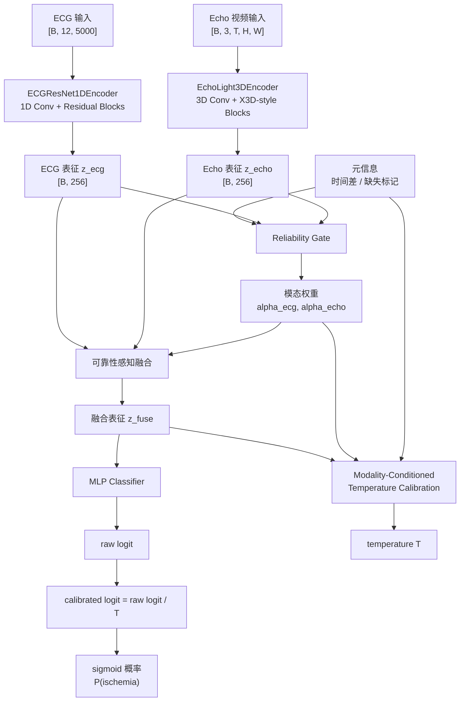

# ECG-Echo 多模态缺血风险分类

本项目实现了一个面向 ECG 与心脏超声视频的多模态缺血风险分类模型。模型输入为 12 导联 ECG 波形和 Echo A4C 视频片段，输出患者缺血风险概率。

核心模型为 **RA-CaFuse**（Reliability-Aware Calibrated Fusion Network），采用从零训练的 ECG 分支、Echo 分支、可靠性感知融合模块和模态条件温度校准模块，不依赖外部预训练 backbone。

## 任务定义

给定一对 ECG 与 Echo 检查：

```text
ECG:  [B, 12, 5000]
Echo: [B, 3, T, H, W]
```

模型预测二分类缺血风险：

```text
0 = 非缺血
1 = 缺血
```

推荐输入规格：

```text
ECG:  12导联，500 Hz，10秒，长度 5000
Echo: 16帧，RGB，112×112 或 224×224
```

## 模型创新点

- **双流从零训练架构**：ECG 使用 1D residual CNN，Echo 使用轻量 3D CNN，避免依赖外部医学视频或动作识别预训练权重。
- **可靠性感知融合**：根据 ECG 表征、Echo 表征和时间差等元信息，动态生成 `alpha_ecg` 与 `alpha_echo`，为不同样本自适应分配模态权重。
- **跨模态残差融合**：融合特征由加权模态表征和 concat-MLP 残差共同组成，比简单拼接更稳定。
- **目标感知不平衡损失**：联合优化 weighted focal BCE、pairwise AUC margin loss 和 Brier calibration loss，同时关注 F1、AUC 与概率校准。
- **模态条件温度校准**：根据融合特征和模态可靠性权重预测样本级 temperature，使不确定样本的概率输出更保守。
- **患者级交叉验证**：训练脚本支持 patient-level 5-fold split，避免同一患者跨训练和测试集合造成患者重叠。

## 模型架构



## 目录结构

```text
configs/
  racafuse_from_scratch.yaml          # RA-CaFuse 训练配置

datasets/
  racafuse_dataset.py                 # ECG-Echo paired HDF5 Dataset

losses/
  ranking_calibration_losses.py       # focal / AUC margin / Brier loss

models/
  ecg_encoder.py                      # ECG 1D encoder
  echo_3d_encoder.py                  # Echo 3D encoder
  racafuse.py                         # RA-CaFuse 主模型

scripts/
  build_hdf5_shards.py                # DICOM/WFDB 转 HDF5
  build_racafuse_manifest.py          # 构建配对 manifest 和 patient-level CV split
  train_racafuse_cv.py                # 5-fold 训练与评估

utils/
  cv_split.py                         # 患者级分组划分
  dicom_io.py                         # Echo DICOM 读取工具
  hdf5_io.py                          # HDF5 读取与 ECG digital 解码
  metrics.py                          # AUROC / AUPRC / F1 等指标
  video_transforms.py                 # 视频 resize / crop / normalize
  wfdb_io.py                          # ECG WFDB 读取工具
```

## 数据 Manifest

训练 manifest 至少需要包含：

```text
sample_id
patient_id
label
time_delta_days
echo_h5_path
echo_h5_key
ecg_h5_path
ecg_h5_key
```

split 文件至少需要包含：

```text
sample_id
patient_id
label
fold
split
```

其中 `split` 可取：

```text
train
inner_val
outer_test
```

## 训练

```bash
CUDA_VISIBLE_DEVICES=0 python scripts/train_racafuse_cv.py \
  --config configs/racafuse_from_scratch.yaml
```

训练完成后，每个 fold 会保存：

```text
outputs/racafuse_from_scratch/fold_*/best.ckpt
outputs/racafuse_from_scratch/fold_*/outer_test_predictions.csv
outputs/racafuse_from_scratch/summary.json
```

checkpoint 选择标准为 inner validation AUROC。

## 加载单个权重完成推理

如果只交付一个训练好的任务 checkpoint，例如：

```text
best.ckpt
```

外部评估时不需要五折目录，也不需要任何外部预训练权重。`best.ckpt` 中已经包含 RA-CaFuse 的完整任务参数。

示例代码：

```python
import torch
import yaml

from scripts.train_racafuse_cv import make_model

config_path = "configs/racafuse_from_scratch.yaml"
ckpt_path = "best.ckpt"

with open(config_path, "r", encoding="utf-8") as f:
    config = yaml.safe_load(f)

device = "cuda" if torch.cuda.is_available() else "cpu"

model = make_model(config).to(device)

checkpoint = torch.load(
    ckpt_path,
    map_location=device,
    weights_only=True,
)
model.load_state_dict(checkpoint["model_state_dict"])
model.eval()
```

单个 batch 推理：

```python
with torch.no_grad():
    output = model(
        ecg=ecg_tensor.to(device),      # [B, 12, 5000]
        echo=echo_tensor.to(device),    # [B, 3, T, H, W]
        meta=meta_tensor.to(device),    # [B, 3]
    )

    logits = output["calibrated_logit"]
    probabilities = torch.sigmoid(logits)
```

`meta_tensor` 默认包含：

```text
meta[:, 0] = ECG-Echo 时间差 / 30
meta[:, 1] = ECG 缺失标记
meta[:, 2] = Echo 缺失标记
```

如果没有额外元信息，可以使用全零张量：

```python
meta_tensor = torch.zeros(batch_size, 3)
```

## 输出指标

训练脚本默认输出：

```text
AUROC
AUPRC
F1
Accuracy
Balanced Accuracy
Sensitivity
Specificity
```

汇总文件格式：

```json
{
  "summary": {
    "f1_mean": 0.0,
    "f1_std": 0.0,
    "roc_auc_mean": 0.0,
    "roc_auc_std": 0.0,
    "accuracy_mean": 0.0,
    "accuracy_std": 0.0,
    "balanced_accuracy_mean": 0.0,
    "balanced_accuracy_std": 0.0,
    "pr_auc_mean": 0.0,
    "pr_auc_std": 0.0,
    "sensitivity_mean": 0.0,
    "sensitivity_std": 0.0,
    "specificity_mean": 0.0,
    "specificity_std": 0.0
  }
}
```

## 注意事项

- 医学原始数据、HDF5 缓存、训练输出、checkpoint 和患者级预测结果不应提交到代码仓库。
- 外部评估只需要代码、配置文件和一个训练好的 `best.ckpt`。
- 正式结果应使用患者级 held-out split 或 patient-level cross validation。
- `raw_logit` 用于未校准输出，`calibrated_logit` 用于最终概率推理。
