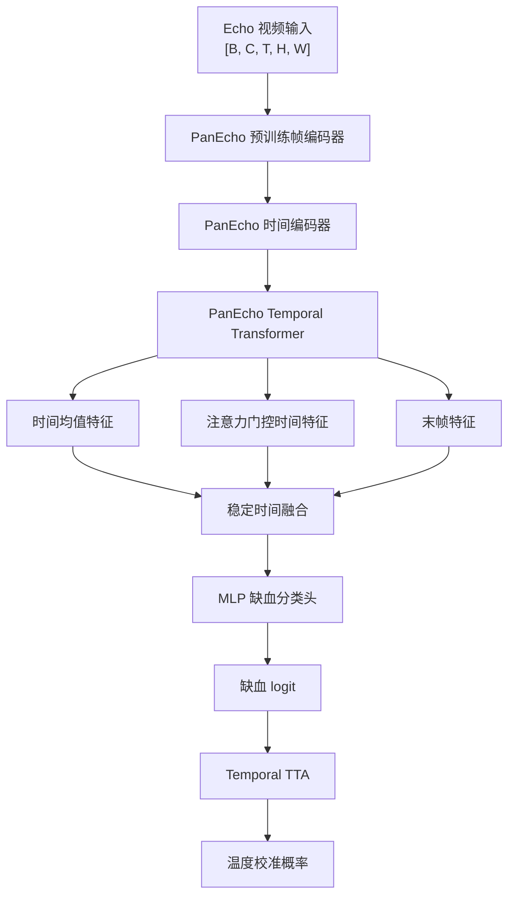

# ECG Echo MM

面向缺血性 HFrEF 风险筛查的医学多模态深度学习项目。项目重点支持心脏超声视频单模态建模，并预留 ECG 与 Echo 多模态融合接口。

## 项目目标

本项目围绕以下任务构建可复现实验框架：

- Echo 心脏超声视频缺血性分类；
- ECG 单模态接口预留；
- ECG + Echo 多模态融合分类；
- 多任务辅助标签扩展；
- 患者级训练、验证、测试划分；
- AUROC、PR-AUC、F1、Sensitivity、Specificity 等医学分类指标评估。

## 目录结构

```text
configs/      实验配置文件
datasets/     Echo、ECG、多模态数据读取
models/       视频 backbone、PanEcho 适配器、分类头、融合模块
scripts/      训练、评估、数据审计、预处理脚本
utils/        指标、视频变换、DICOM/HDF5/WFDB 读写、划分工具
```

## Echo 模型结构

当前 Echo 主模型基于 PanEcho 预训练视频表征，并在其上构建面向缺血性分类的轻量任务头。



## 特色设计

- **医学视频预训练接入**：支持本地加载 PanEcho 官方结构与权重，避免预训练权重缺失时静默回退到随机初始化。
- **稳定时间聚合**：结合时间均值、注意力门控特征和末帧特征，降低单一 attention pooling 的不稳定性。
- **两阶段训练策略**：先冻结 backbone 训练任务头，再解冻后层 temporal blocks 进行 partial fine-tuning。
- **患者级划分**：支持按 `subject_id` 进行患者级 split，降低同一患者跨集合造成的数据泄露风险。
- **多模态扩展**：保留 ECG encoder、Echo encoder 和多模态 dataset 接口，便于后续接入 ECG + Echo 融合模型。
- **推理增强**：支持 temporal test-time augmentation 与 temperature scaling。
- **配置驱动**：数据路径、标签字段、模型结构、学习率、batch size、帧数、图像尺寸等均由 YAML 配置控制。

## 数据格式约定

Echo 训练 manifest 推荐包含以下字段：

```text
sample_id
subject_id
h5_path
h5_key
final_ischemia_label
eligible_for_training
```

交叉验证 split 文件推荐包含：

```text
sample_id
subject_id
fold
split
```

其中 `split` 可取：

```text
train
inner_val
outer_test
```

## 预训练权重

预训练权重不随代码仓库保存。训练时需要在本地准备：

```text
checkpoints/pretrained/panecho.pt
checkpoints/pretrained/r2plus1d_18-91a641e6.pth
third_party/PanEcho/
```

其中 PanEcho 训练需要同时提供官方代码仓库和 `panecho.pt` 权重文件。
https://www.cards-lab.org/panecho

## 加载模型 checkpoint

训练完成后的任务权重是单个 `.ckpt` 文件，里面包含完整的 `model_state_dict`。推理时可以只用 `.ckpt` 恢复最终模型参数，不需要再次读取 `checkpoints/pretrained/panecho.pt`。

加载逻辑是：

```text
先根据 YAML 和 third_party/PanEcho/ 构建模型结构
再加载 best.ckpt 中的 model_state_dict 覆盖全部参数
```

典型文件结构：

```text
best.ckpt
configs/echo_panecho_turbo_stage2.yaml
third_party/PanEcho/
```

加载示例：

```python
import torch
import yaml

from scripts.train_echo_cv import make_model

config_path = "configs/echo_panecho_turbo_stage2.yaml"
ckpt_path = "best.ckpt"

with open(config_path, "r", encoding="utf-8") as f:
    config = yaml.safe_load(f)

# 推理时不再读取 panecho.pt，只构建 PanEcho 结构。
# best.ckpt 会覆盖完整模型参数。
config["model"]["pretrained"] = False
config["model"].pop("checkpoint_path", None)

device = "cuda" if torch.cuda.is_available() else "cpu"

model = make_model(config).to(device)

checkpoint = torch.load(
    ckpt_path,
    map_location=device,
    weights_only=True,
)
model.load_state_dict(checkpoint["model_state_dict"])
model.eval()
```

单个 batch 推理：

```python
with torch.no_grad():
    logits = model(video_tensor.to(device))  # video_tensor: [B, C, T, H, W]
    probabilities = torch.sigmoid(logits)
```

如果需要复现训练时的 TTA 推理，可复用训练脚本中的 `predict_logits`：

```python
from scripts.train_echo_cv import predict_logits

tta_shifts = [0, 4, 8]

with torch.no_grad():
    logits = predict_logits(model, video_tensor.to(device), tta_shifts=tta_shifts)
    probabilities = torch.sigmoid(logits)
```

常见权重文件区别：

```text
checkpoints/pretrained/panecho.pt
  PanEcho 官方预训练权重，用于训练初始化 backbone；推理加载 best.ckpt 时不再需要。

checkpoints/pretrained/r2plus1d_18-91a641e6.pth
  R(2+1)D-18 官方 Kinetics-400 预训练权重，用于初始化 R(2+1)D backbone。

best.ckpt
  当前任务训练后的完整 checkpoint，用于恢复模型并进行缺血分类推理。
```

## 主要配置

- `configs/echo_panecho_turbo_stage1.yaml`：PanEcho 冻结 backbone 训练任务头；
- `configs/echo_panecho_turbo_stage2.yaml`：PanEcho partial fine-tuning；
- `configs/echo_panecho_industrial_stage1.yaml`：稳定版 Stage 1；
- `configs/echo_panecho_industrial_stage2.yaml`：稳定版 Stage 2；
- `configs/echo_r2plus1d_ft_5fold.yaml`：R(2+1)D-18 视频模型基线。

## 训练命令

PanEcho Stage 1：

```bash
CUDA_VISIBLE_DEVICES=0 python scripts/train_echo_cv.py \
  --config configs/echo_panecho_turbo_stage1.yaml
```

PanEcho Stage 2：

```bash
CUDA_VISIBLE_DEVICES=0 python scripts/train_echo_cv.py \
  --config path/to/stage2_fold_01.yaml \
  --fold 1
```

R(2+1)D-18 baseline：

```bash
CUDA_VISIBLE_DEVICES=0 python scripts/train_echo_cv.py \
  --config configs/echo_r2plus1d_ft_5fold.yaml
```

## 注意事项

- 医学数据、HDF5 分片、DICOM 文件、checkpoint 和患者级预测结果不应提交到代码仓库；
- 正式实验应使用患者级 held-out split；
- AUROC、PR-AUC、F1、Sensitivity、Specificity 应同时报告，不建议只报告 accuracy；
- 若更换主标签或辅助标签，应优先在 YAML 配置中修改字段名，而不是改训练代码。
